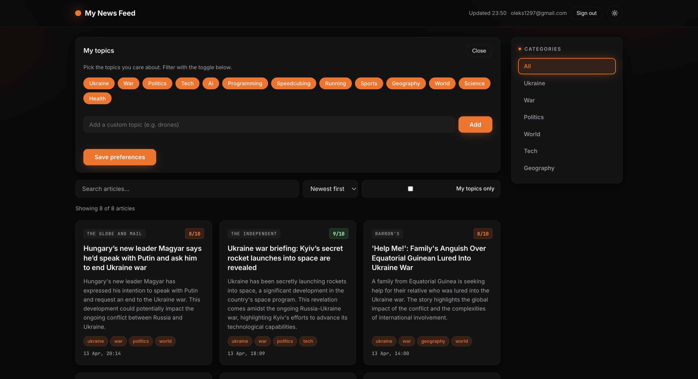
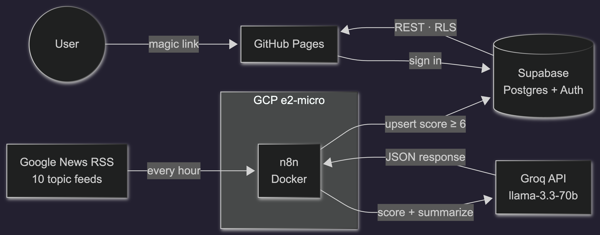
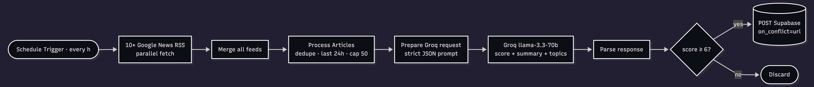

# News Aggregator

A fully autonomous personalized news source. Totaly free. Runs on a $0 GCP Always Free VM + Groq API + Supabase + GitHub Pages. Scores and summarizes news articles with Groq's LLM, takes the best ones in a clean web UI, and keeps you in the loop on what matters.

**Live demo:** <https://oleksii-lasiichuk.github.io/news-aggregator/>

## Stack

| Layer | Tech | Why |
| --- | --- | --- |
| Orchestration | [n8n](https://n8n.io/) (self-hosted, Docker) | Visual DAG of scheduled HTTP/Code/DB steps |
| Compute | Google Cloud e2-micro (Always Free) | 1 vCPU + 1 GB RAM, free forever in `us-central1`/`us-east1`/`us-west1` |
| LLM | [Groq](https://groq.com/) — `llama-3.3-70b-versatile` | OpenAI-compatible, 14 400 req/day free |
| Database + Auth | [Supabase](https://supabase.com/) | Postgres + REST + magic-link email, 500 MB free |
| Frontend | Vanilla HTML/CSS/JS + Supabase JS SDK | No framework, no build step |
| Host | GitHub Pages | Free static hosting from `/docs` |
| Sources | Google News RSS topic queries | Single provider, never 404s |

---

## Architecture

## Workflow

## License

[MIT](LICENSE) — do whatever, no warranty.

## Acknowledgements

[n8n](https://n8n.io/) · [Groq](https://groq.com/) · [Supabase](https://supabase.com/) · [Google News RSS](https://news.google.com/)
